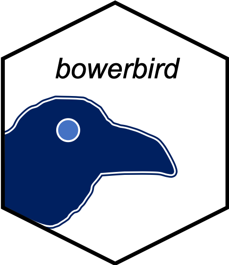

[](https://github.com/clatworthylab/bowerbird/actions/workflows/r.yml)

# bowerbird
A single-cell package for Functional Annotation + Gene Module Summarization.



*Bowerbirds are famous for the elaborate and sometimes whimsical structures that males build to court females.*

<a href="https://blog.nature.org/science/2021/01/04/bowerbirds-meet-the-bird-worlds-kleptomaniac-love-architects/"></a>

Picture credits:
A satin bowerbird’s bower, decorated with blue objects. © Stefan Marks / [Flickr](https://www.flickr.com/photos/stefan_marks/32487196918/)

I'm not sure if this mating ritual is in anyway similar to my attempts to visualise pathway analyses and their association with celltype identities/states... who cares. It's just a name.

```{r, include = FALSE}
knitr::opts_chunk$set(
  collapse = TRUE,
  comment = "#>"
)
```

## Installation
```R
# because currently private, requires specifying personal github access token
# devtools::install_github('clatworthylab/bowerbird', auth_token = "insert_your_personal_github_access_token")
# or clone this repo and do devtools::install('path/of/folder/to/bowerbird')
```

## Quick Usage
Pathway analyis is tricky; often there's too many pathways/terms to use and it's not easy to distinguish how important every element is. `bowerbird` attempts to summarise your pathways of interests into potentially meaningful functional annotation modules which you can then take forward to pathway analyses, or the reverse situation where you have a set of pathways that were determined <i>a priori</i> to be significant and you wanted to find out how to interpret it. To do this, we compute a shortest nearest neighbor graph using the genes in the gene sets/pathways and learn a representative summary term from the name of the gene sets that cluster together.
```{r, echo=FALSE}
library(bowerbird)
# download from msigdb website
gmt_file <- system.file("extdata", "h.all.v7.4.symbols.gmt", package = "bowerbird")
bwr <- bower(gmt_file) # this performs a read_geneset step internally, which accepts .gmt, .gmx, .csv, .tsv, .txt, or R objects as list or data.frame format.
bwr <- snn_graph(bwr)
bwr <- find_clusters(bwr)
bwr <- summarize_clusters(bwr)
bwr
```

## Examples of different ways of loading in genesets

Example #1 Doing some manual editing of a predefined geneset.
```{r, echo=FALSE}
library(bowerbird)
# download from msigdb website
file <- system.file("extdata", "c5.go.bp.v7.4.symbols.gmt", package = "bowerbird")
# manualy read in to do some fine adjustments/filtering
geneset <- read_geneset(file) # reads in gene file manually
# do a bit of manual filtering
geneset <- geneset[grep('B_CELL|T_CELL|NATURAL_KILLER|ANTIBODY|ANTIGEN|LYMPHOCYTE|IMMUNE|INTERFERON|TOLL|INNATE|ADAPTIVE', names(geneset))]
geneset <- geneset[!grepl('TROPHOBLAST_CELL|FAT_CELL|ENT_CELL', names(geneset))]

bwr <- bower(geneset)
bwr <- snn_graph(bwr)
bwr <- find_clusters(bwr)
bwr <- summarize_clusters(bwr)
```

Example #2 Extracting from `msigdbr`.
```{r, echo=FALSE}
library(bowerbird)
library(msigdbr)
GO <- data.frame(msigdbr::msigdbr(category = "C5", subcategory = "GO:BP"))
genesets <- GO[grep('B_CELL|T_CELL|NATURAL_KILLER|ANTIBODY|ANTIGEN|LYMPHOCYTE|IMMUNE|INTERFERON|TOLL|INNATE|ADAPTIVE', GO$gs_name), ]
genesets <- genesets[!grepl('TROPHOBLAST_CELL|FAT_CELL|ENT_CELL', genesets$gs_name), ]

# convert to list
gs_list <- lapply(unique(genesets$gs_name), function(x) genesets[genesets$gs_name %in% x, "gene_symbol"])
names(gs_list) <- unique(genesets$gs_name)

bwr <- bower(gs_list)
bwr <- snn_graph(bwr)
bwr <- find_clusters(bwr)
bwr <- summarize_clusters(bwr)
```

## geneset enrichment analysis
To do this, we would need either a single-cell object (`SingleCellExperiment` or `Seurat`), or a list containing differential gene testing results
```{r, echo=FALSE}
# load a dummy dataset
library(ktplots)
data(kidneyimmune)

# with single-cell methods:

## AUCell
bwr <- enrich_genesets(kidneyimmune, bwr, groupby = 'celltype', mode = 'AUCell')

## Seurat::AddModuleScore
bwr <- enrich_genesets(kidneyimmune, bwr, groupby = 'celltype', mode = 'Seurat')

## scanpy.tl.score_genes
bwr <- enrich_genesets(kidneyimmune, bwr, groupby = 'celltype', mode = 'scanpy')

# plot
library(ggraph)
library(ggplot2)
plot_list <- lapply(colnames(bwr@scores), function(ds){
  set.seed(100)
  igraph::V(bwr@graph)$score <- bwr@scores[, ds]
  g <- ggraph(bwr@graph, 'igraph', algorithm = 'fr') + 
    geom_edge_link(aes(width = weight), alpha = .25) +
    geom_node_point(aes(color = score, size = geneset_size)) + 
    scale_size_area(max_size = 3) +
    geom_node_text(aes(label = labels), size = 1) +
    theme_bw() +
    theme_void() +
    scale_color_viridis() +
    # scale_color_viridis(limits=c(0, 0.1), oob=scales::squish) +
    scale_edge_width(range = c(0, 1)) +
    ggtitle(ds)
})
names(plot_list) <- colnames(bwr@scores)
cowplot::plot_grid(plotlist = plot_list)
```

as a heatmap
```{r, echo=FALSE}
pheatmap::pheatmap(bwr@scores)
```

# with fgsea on deg tables in a list
```{r, echo=FALSE}
degs <- Seurat::FindAllMarkers(kidneyimmune)
degs <- split(degs, degs$cluster) # so in practice, there should be one DEG table per comparison in a list.
bwr <- enrich_genesets(degs, bwr, gene_symbol = 'gene', logfoldchanges = 'avg_logFC',  pvals = 'p_val')

# plot
plot_list <- lapply(colnames(bwr@scores$NES), function(ds){
  set.seed(100)
  NES <- bwr@scores$NES[, ds]
  padj <- bwr@scores$padj[, ds]
  padj[padj >= 0.25] <- NA
  igraph::V(bwr@graph)$NES <- NES
  igraph::V(bwr@graph)$padj <- padj
  g <- ggraph(bwr@graph, 'igraph', algorithm = 'fr') + 
    geom_edge_link(aes(width = weight), alpha = .25) +
    geom_node_point(aes(color = padj, size = NES)) + 
    scale_size_area(max_size = 3) +
    geom_node_text(aes(label = labels), size = 1) +
    theme_bw() +
    theme_void() +
    scale_color_viridis() +
    # scale_color_viridis(limits=c(0, 0.1), oob=scales::squish) +
    scale_edge_width(range = c(0, 1)) +
    ggtitle(ds) + theme(legend.position = 'none')
})
names(plot_list) <- colnames(bwr@scores$NES)
cowplot::plot_grid(plotlist = plot_list)
```
as a heatmap
```{r, echo=FALSE}
pheatmap::pheatmap(bwr@scores$NES)
```
## Using core genes for enrichment
same function as above, just specifying `core = TRUE`.
```{r, echo=FALSE}
bwr <- enrich_genesets(kidneyimmune, bwr, core = TRUE, groupby = 'celltype') # if mode is not specified, defaults to AUCell.
# output can also be plotted via ggraph as above but i'm using heatmap for convenience.
pheatmap::pheatmap(bwr@scores)
```
same for the gsea results.
```{r, echo=FALSE}
bwr <- enrich_genesets(degs, bwr, core = TRUE, gene_symbol = 'gene', logfoldchanges = 'avg_logFC',  pvals = 'p_val')
pheatmap::pheatmap(bwr@scores$NES)
```
